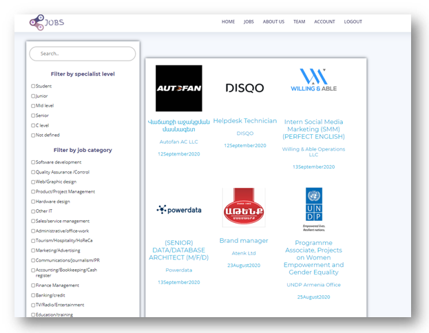

# Project Title
The main object of the project is to create a web site where a person could register, fill in his/her skills from drop-down skill list and search jobs appropriate to his/her profile. The site gives a percentage compliance for specified jobs.

## Instructions

As always ensure you create a virtual environment for this application and install the necessary libraries from the requirements.txt file.

How it looks
----------------
Home page example:


  
 
Jobs page example:


 
Job page example:

!!!!!!

If you are not a registered user you cannot see matching of your skills and  job skills


Database scheme
--------------------


Installation
-----------
To run the API locally, please perform the following steps:

1.Clone the repository from [https://github.com/Liana-V/Project-ACA](https://github.com/Liana-V/Project)
```
$ git clone https://github.com/Liana-V/Project-ACA.git
```

2.Navigate to the checked out project
```
$ cd Jobs
```
3.Create a virtualenv, and activate this:
```
$ virtualenv env 
$ source env/bin/activate
```
4.Install dependencies from `requirements.txt`
```
$ pip install -r requirements.txt
```
    
How to run
-------------
Now you can run the Flask server.
```
(venv) $ python run.py 
```
To see your application, access this url in your browser:
`http://127.0.0.1:5000` 